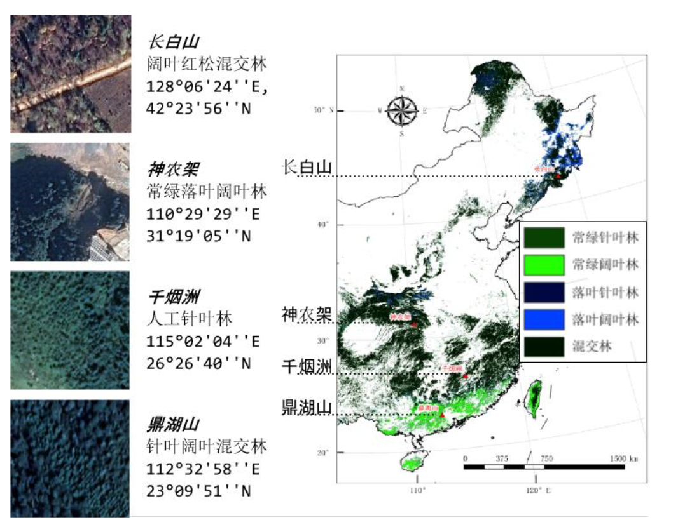
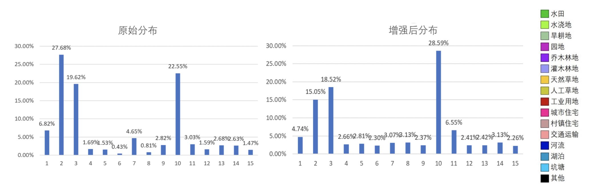
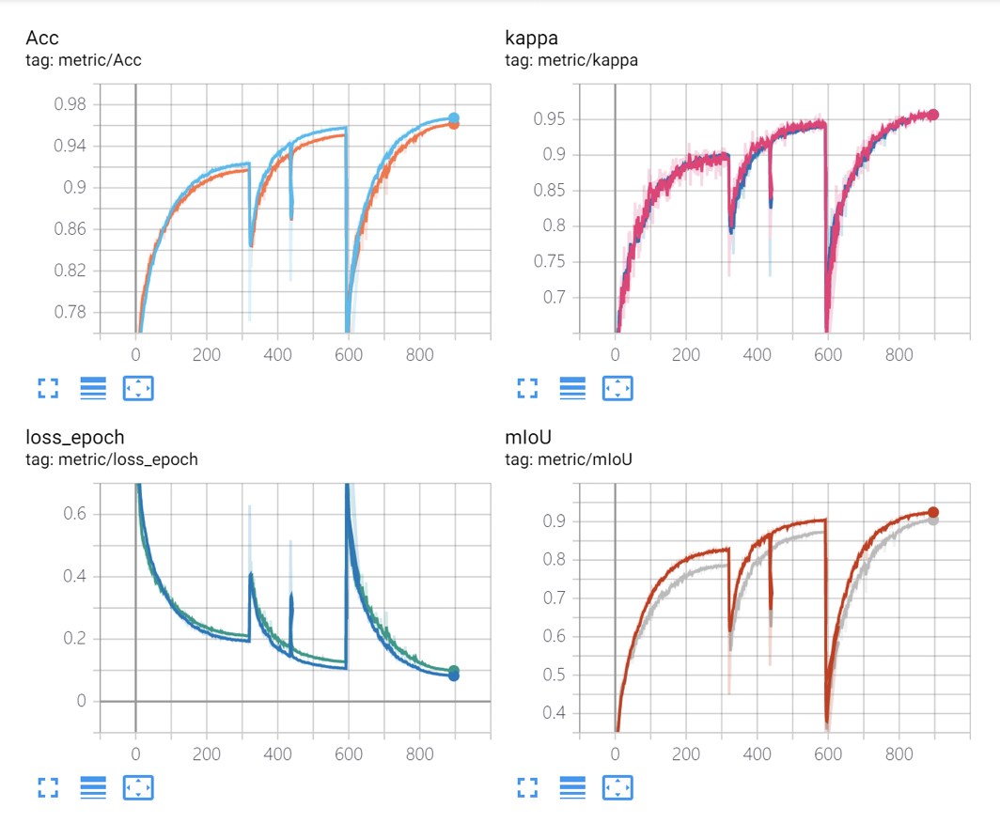

# 遥感图像语义分割


主要做了三次, 第一次是与北师大合作, 对遥感图像提取

是与北师大地理组合作项目下的子任务,目标是尽量准确,清晰地将遥感图像进行语义分割,

## Dataset

遥感图像语义分割的任务主要做了三次.

**北师大地理组**

第一次是和北师大地理组合作, 对他们提供的数据进行语义分割, 提取林地, 草地, 农地以供后续开展其他横向研究,例如水土保持研究,退耕还林,退耕还草效果研究等. 在后续湖北省水土侵蚀因子计算, 就用到了该成果数据. 数据集主要以森林, 湖泊, 农地等非城市用地为主, 并且分布于多个纬度带, 地类具有同物异谱现象. 



**比赛**

第二次是参加2019年遥感图像稀疏表示与智能分析竞赛, 数据集是一个16类的长尾数据集. 其中灌木林地, 人工草地样本严重不足.




**生产场景**

第三次是在实际生产环境中, 进行语义分割. 在实际环境中, 数据集的采集与不同的资源卫星, 后期还需要进行多光谱融合, 历史数据都是依靠arcgis, 或者arcmap手动生成,训练样本图片质量不等. 生产的图像的颜色差异巨大, 需要进行繁琐的数据清理.

并且由于卫星之间的差异, 遥感图像的影像分辨率往往不同, 高分辨可能0.5m-6m/每像素, 低分辨率可能10m以上.

遥感图片的监督数据集人工标注, 标注质量参差不齐.


综上所述, 遥感图像语义分割的难点:

1. 存在相同类别地类样本受所处纬度不同, 后期光学处理具有差异等影响, 会导致类别颜色差异较大.
2. 遥感图像处理广泛存在着长尾效应, 某些类别在自然环境中天然就多, 某一些天然就少.
3. 遥感图像, 存在着空间上, 视野的差距.
4. 实际场景下, 标注质量不等.
5. 遥感图像一般分辨率较高, 数千到几万不等.

在数据处理过程中, 首先对原始影像进行拆解, 因为语义分割模型是全卷积模型, 对于图像分辨率并不限制, 所以裁剪大小随意, 一般为$32$的倍数, 大于等于$256\times256$即可.

离线统计训练集的类别分布, 并按照分布, 生成增强后数据集.

在线数据增加按照数据集特点, 需要进行随机翻转, 随机镜像, 随机放缩, 增加高斯噪声, 增加模糊, 光照处理, 增加颜色变化.

## Backbone

* Resnet50
* Hourglass
* Resnest 

## Model

[语义分割](https://blog.csdn.net/Arron_hou/article/details/94134049)的问题本质上是感受野与特征图之间的冲突, 从FCN到HRNet都在通过制定特定的结构解决这个问题. 传统的语义分割数据上, 一张图往往存在几个物体需要分割, 但是在遥感影像上, 图斑的分布琐碎, 地类变化明显, 判断一个像素的类别不需要参照远距离的信息, 例如一栋房子, 可能在遥感影像上就几十个像素值, 经过特征提取后, 反应在特征图上可能就几个像素.因此, 感受野可以不需要太大, 特征图就可以保留更多的空间信息.

**UNet**

由于遥感影像和医学影像在类别的分布, 类别的大小具有相似性, 所有模型也可以参考医学影像语义分割的相关模型.其中最出名的便是UNet. 目前典型的做法就是将UNet的特征提取部分替换为resnet系列backbone, 移除FC层, 每次下采样都将特征保留, 便于上采样时, 融合特征.

**FCN**

魔改最初 FCN

**PSPNet**

**DeepLabV3+**

Attention

NAS

* auto DeepLab
* 平民版NAS

HRNet

* PointRend Image Segmentation as Rendering
* TensorMask: A Foundation for Dense Object Segmentation

## Loss

> [从loss处理图像分割中类别极度不均衡的状况](https://blog.csdn.net/m0_37477175/article/details/83004746)

语义分割本质上就是逐像素分类, 最基础会使用 crossEntropyLoss作为分类loss. 

但是由于样本分布不均, 数据集具有长尾效应,直接训练, 小样本类别会有明显的错检和漏检, 也就是假阳性, 假阴性.

这个时候, 就可以通过对loss进行优化, 提高模型性能.

优化的方式主要分为两类, 一类是基于分类算法的, 一类是基于评价指标的.

**Weight Cross Entropy Loss**

pytorch 版本的crossEntropyLoss 可以增加类别权重

基本的方法就是通过统计, 根据样本类别数量得到类别权重, 使得前景类的权重变大, 并且类别数量越小, 则 weight 越大.
$$
w_i = \text{softmax}(\max(n)-n_i)
$$
**Focal Loss**

focal loss 被提出用来处理目标检测中高密度检测器中的正负样本不均衡的问题.

主要产生作用的就是通过 $\gamma$ 参数衰减大量负样本所导致loss迅速下降的速度.

原始的 focal loss 适用于2分类分割问题. $-(1-\hat y) log(y)$是二分类使用的loss.
$$
p_{\mathrm{t}}=\left\{\begin{array}{ll}
p & \text { if } y=1 \\
1-p & \text { otherwise }
\end{array}\right.
$$

$$
\operatorname{FL}\left(p_{\mathrm{t}}\right)=-\alpha_{\mathrm{t}}\left(1-p_{\mathrm{t}}\right)^{\gamma} \log \left(p_{\mathrm{t}}\right)
$$

可以参考 cross-entropy 修改为多分类 loss, 去掉了 $\alpha$ 参数.

```python
import torch
from torch import nn
from torch.nn import functional as F


class FocalLoss(nn.Module):

    def __init__(self, gamma=0):
        super(FocalLoss, self).__init__()
        self.gamma = gamma

    def forward(self, input: torch.Tensor, target: torch.Tensor):
        pt = F.softmax(input, dim=1)
        onehot = torch.zeros_like(input).scatter_(1, target.unsqueeze(1), 1)
        loss = - (1.0 - pt * onehot) ** self.gamma * onehot * F.log_softmax(input, 1)
        return loss.sum() / target.size(0)/target.size(1)target.size(2)
```

**Dice Loss**

p表示预测, g 表示真值, $|\cdot|$ 表示数量
$$
\operatorname{DL}(p_t, g_t)=1-2 \frac{|p_t \cap g_t|}{|p_t|+|g_t|}
$$
**Generalized Dice Loss**
$$
\operatorname{GDL}(p, g)=1-2 \frac{\sum_{t=1}^{T}w_t|p_t \cap g_l|}{\sum_{t=1}^{T}\left(w_t|p_t|+|g_t|\right)},w_t=\frac{1}{|g_t|^{2}}
$$


**The Lovasz-Softmax loss**
$$
\operatorname{DL}(p_t, g_t)=1-\frac{|p_t \cap g_t|}{|p_t\cup g_t|}
$$
将**IOUloss**转换为可导形式.

## Train Tricks

* Reset Learning Rate

  

* Radam+lookahead

* apex 混合精度训练 训练速度提高一半, 显存占用减少一半, 20以上的卡

* learning rate ReduceLROnPlateau

* SGD(parameters, lr, momentum=0.9, weight_decay=5e-4, nesterov=True)

## Test Tricks

1024 256 overlap

## Problems

标注不准确

缺乏迭代策略

多个数据集, 分布不同, 存在 domain bias